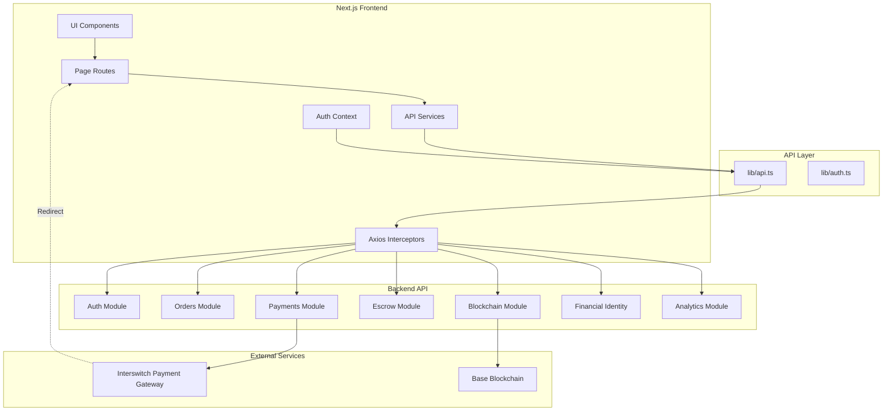
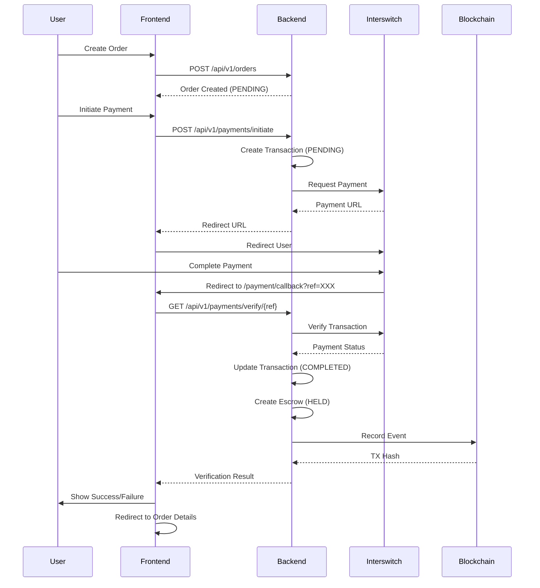

# Design Document: Backend API Integration for AgroChain AI Frontend

## Overview

This design provides a comprehensive integration strategy for connecting the Next.js frontend with the AgroChain AI Backend API. The backend provides a complete agricultural trading platform with payment processing (Interswitch), escrow management, blockchain verification, AI-powered financial identity scoring, and analytics. The frontend currently has partial integration but is missing critical payment callback handling and several API service functions. This design addresses the missing `/payment/callback` route requirement and establishes patterns for all API integrations.

The payment flow is currently broken: payments are initiated and redirect URLs are generated, but the frontend lacks the `/payment/callback` route to handle Interswitch redirects and verify transactions. This design prioritizes fixing this critical issue while establishing comprehensive API integration patterns.

## Architecture



## Payment Flow Sequence



## Components and Interfaces

### 1. Payment Callback Route (CRITICAL - MISSING)

**Purpose**: Handle Interswitch payment redirects and verify transactions

**Route**: `/payment/callback` (maps to `app/payment/callback/page.tsx`)

**Interface**:
```typescript
// URL: /payment/callback?ref=PAYMENT_REFERENCE
interface CallbackPageProps {
  searchParams: Promise<{ ref?: string }>;
}

interface PaymentVerificationResponse {
  status: 'SUCCESS' | 'FAILED' | 'PENDING';
  orderId: string;
  transactionRef: string;
  amount: number;
  message: string;
}
```

**Responsibilities**:
- Extract `ref` parameter from URL query string
- Call backend verification endpoint: `GET /api/v1/payments/verify/{ref}`
- Display loading state during verification
- Handle success: show confirmation, redirect to order details
- Handle failure: show error message, provide retry options
- Handle edge cases: missing ref, network errors, expired payments

**Error Scenarios**:
- Missing `ref` parameter → Show error, redirect to orders
- Invalid `ref` → Show "Payment not found" error
- Network failure → Show retry button
- Backend returns FAILED → Show payment failed message
- Backend returns PENDING → Show "Payment processing" message

### 2. API Service Layer

**Purpose**: Centralized API service functions for all backend endpoints

**File**: `lib/services/api-service.ts`

**Interface**:
```typescript
// Auth Services
interface LoginCredentials {
  email: string;
  password: string;
}

interface RegisterData {
  email: string;
  password: string;
  role: UserRole;
  full_name: string;
  phone?: string;
}

interface AuthResponse {
  accessToken: string;
  user: Profile;
}

// Order Services
interface CreateOrderData {
  seller_id: string;
  produce_type: string;
  quantity: number;
  unit: string;
  unit_price: number;
  delivery_address: string;
  notes?: string;
}

interface OrderListParams {
  page?: number;
  limit?: number;
  status?: OrderStatus;
}

interface PaginatedResponse<T> {
  data: T[];
  pagination: {
    page: number;
    limit: number;
    total: number;
    totalPages: number;
  };
}

// Payment Services
interface InitiatePaymentData {
  orderId: string;
  amount: number;
  currency: Currency;
}

interface PaymentInitiationResponse {
  redirectUrl: string;
  transactionRef: string;
}

// Escrow Services
interface EscrowResponse {
  id: string;
  order_id: string;
  amount: number;
  status: EscrowStatus;
  payment_reference: string;
  blockchain_tx_hash: string | null;
  created_at: string;
  released_at: string | null;
}

// Blockchain Services
interface BlockchainProofResponse {
  order_id: string;
  events: BlockchainProof[];
}

// Financial Identity Services
interface FinancialIdentityResponse {
  identity: FinancialIdentity;
  recommendations: string[];
}

// Analytics Services
interface TradeCorridorParams {
  startDate?: string;
  endDate?: string;
  produceType?: string;
}

interface FxRateParams {
  from: Currency;
  to: Currency;
  amount: number;
}

interface FxRateResponse {
  from: Currency;
  to: Currency;
  rate: number;
  convertedAmount: number;
  timestamp: string;
}
```

### 3. Enhanced Error Handling

**Purpose**: Consistent error handling across all API calls

**Interface**:
```typescript
interface ApiError {
  message: string;
  statusCode: number;
  errors?: Record<string, string[]>;
}

interface ApiResponse<T> {
  success: boolean;
  data?: T;
  error?: ApiError;
}
```

### 4. Loading State Management

**Purpose**: Consistent loading states for async operations

**Interface**:
```typescript
interface AsyncState<T> {
  data: T | null;
  loading: boolean;
  error: string | null;
}

// React Hook Pattern
function useAsyncData<T>(fetcher: () => Promise<T>): AsyncState<T>;
```

## Key Functions with Formal Specifications

### Function 1: verifyPayment()

```typescript
async function verifyPayment(ref: string): Promise<PaymentVerificationResponse>
```

**Preconditions:**
- `ref` is non-empty string
- `ref` matches format: alphanumeric, 10-50 characters
- User is authenticated (has valid token)
- Backend API is accessible

**Postconditions:**
- Returns PaymentVerificationResponse object
- If SUCCESS: `response.status === 'SUCCESS'` and `response.orderId` is valid UUID
- If FAILED: `response.status === 'FAILED'` and `response.message` contains error description
- No side effects on payment state (read-only operation)
- Throws error only on network/server failures, not on payment failures

**Error Handling:**
- Network error → Throw with retry-able flag
- 404 Not Found → Return FAILED status with "Payment not found"
- 401 Unauthorized → Trigger auth refresh, retry once
- 500 Server Error → Throw with error message

### Function 2: initiatePayment()

```typescript
async function initiatePayment(data: InitiatePaymentData): Promise<PaymentInitiationResponse>
```

**Preconditions:**
- `data.orderId` is valid UUID
- `data.amount` is positive number
- `data.currency` is valid Currency enum value
- Order exists and is in PENDING status
- User is authenticated and is the buyer of the order

**Postconditions:**
- Returns PaymentInitiationResponse with valid redirectUrl
- Transaction record created in backend with PENDING status
- `redirectUrl` is valid Interswitch payment URL
- `transactionRef` is unique identifier for tracking

**Error Handling:**
- Invalid orderId → Throw "Order not found"
- Order not PENDING → Throw "Order already paid"
- Amount mismatch → Throw "Amount does not match order"
- Interswitch error → Throw with provider error message

### Function 3: createOrder()

```typescript
async function createOrder(data: CreateOrderData): Promise<ProduceOrder>
```

**Preconditions:**
- `data.seller_id` is valid user UUID with SELLER role
- `data.quantity` is positive number
- `data.unit_price` is positive number
- `data.produce_type` is non-empty string
- `data.delivery_address` is non-empty string
- User is authenticated with BUYER role

**Postconditions:**
- Returns created ProduceOrder with status PENDING
- `order.total_amount === data.quantity * data.unit_price`
- `order.buyer_id === authenticated_user.id`
- Order is persisted in database
- Seller receives notification (async, non-blocking)

**Error Handling:**
- Invalid seller_id → Throw "Seller not found"
- Seller not verified → Throw "Seller not verified"
- Validation errors → Throw with field-specific messages

### Function 4: confirmDelivery()

```typescript
async function confirmDelivery(orderId: string): Promise<ProduceOrder>
```

**Preconditions:**
- `orderId` is valid UUID
- Order exists and status is DELIVERED
- User is authenticated and is the buyer of the order
- Escrow exists for this order with status HELD

**Postconditions:**
- Order status updated to COMPLETED
- Escrow status updated to RELEASED
- Funds transferred to seller (async process)
- Blockchain event recorded
- Returns updated order with status COMPLETED

**Error Handling:**
- Order not DELIVERED → Throw "Cannot confirm delivery for order in current status"
- Not order buyer → Throw "Unauthorized"
- Escrow already released → Throw "Escrow already processed"

### Function 5: getFinancialIdentity()

```typescript
async function getFinancialIdentity(userId: string): Promise<FinancialIdentityResponse>
```

**Preconditions:**
- `userId` is valid UUID
- User exists in system
- Requesting user is authenticated
- Requesting user is either the userId owner or has ADMIN role

**Postconditions:**
- Returns FinancialIdentity with AI-computed credit score
- `identity.credit_readiness_score` is between 0 and 100
- `identity.risk_indicators` is array of risk assessments
- `identity.transaction_history_summary` contains aggregated metrics
- No mutations to user data

**Error Handling:**
- User not found → Throw "User not found"
- Unauthorized access → Throw "Cannot view other user's financial identity"
- Insufficient data → Return identity with NEEDS_MORE_DATA eligibility

## Algorithmic Pseudocode

### Main Payment Verification Algorithm

```pascal
ALGORITHM handlePaymentCallback(searchParams)
INPUT: searchParams containing ref parameter
OUTPUT: UI state (loading, success, or failure)

BEGIN
  // Step 1: Extract and validate reference
  ref ← searchParams.ref
  
  IF ref IS NULL OR ref IS EMPTY THEN
    DISPLAY error "Missing payment reference"
    REDIRECT to "/orders"
    RETURN
  END IF
  
  // Step 2: Set loading state
  SET uiState ← "loading"
  DISPLAY loading spinner with message "Verifying payment..."
  
  // Step 3: Call verification API with retry logic
  maxRetries ← 3
  retryCount ← 0
  verificationResult ← NULL
  
  WHILE retryCount < maxRetries AND verificationResult IS NULL DO
    TRY
      verificationResult ← API.get(`/payments/verify/${ref}`)
      BREAK
    CATCH NetworkError AS error
      retryCount ← retryCount + 1
      IF retryCount < maxRetries THEN
        WAIT exponentialBackoff(retryCount)
      ELSE
        THROW error
      END IF
    END TRY
  END WHILE
  
  // Step 4: Process verification result
  IF verificationResult.status EQUALS "SUCCESS" THEN
    SET uiState ← "success"
    DISPLAY success message
    DISPLAY order details link
    
    // Optional: Auto-redirect after delay
    WAIT 3 seconds
    REDIRECT to `/orders/${verificationResult.orderId}`
    
  ELSE IF verificationResult.status EQUALS "FAILED" THEN
    SET uiState ← "failed"
    DISPLAY failure message with reason
    DISPLAY retry button
    DISPLAY support contact link
    
  ELSE IF verificationResult.status EQUALS "PENDING" THEN
    SET uiState ← "pending"
    DISPLAY "Payment is being processed" message
    DISPLAY "Check back in a few minutes" instruction
    
  ELSE
    SET uiState ← "failed"
    DISPLAY "Unknown payment status" error
  END IF
  
END
```

**Preconditions:**
- searchParams object is provided
- User has network connectivity
- Backend API is operational

**Postconditions:**
- UI displays appropriate state (loading, success, failure, pending)
- User is redirected to appropriate page
- Toast notifications shown for success/failure
- No payment state mutations (verification is read-only)

**Loop Invariants:**
- retryCount ≤ maxRetries throughout retry loop
- verificationResult remains NULL until successful API call
- UI state remains "loading" during retry attempts

### Order Creation with Payment Initiation Algorithm

```pascal
ALGORITHM createOrderWithPayment(orderData)
INPUT: orderData containing order details
OUTPUT: redirectUrl for payment or error

BEGIN
  // Step 1: Validate order data
  ASSERT orderData.seller_id IS NOT NULL
  ASSERT orderData.quantity > 0
  ASSERT orderData.unit_price > 0
  ASSERT orderData.produce_type IS NOT EMPTY
  ASSERT orderData.delivery_address IS NOT EMPTY
  
  // Step 2: Calculate total amount
  totalAmount ← orderData.quantity * orderData.unit_price
  
  // Step 3: Create order
  TRY
    order ← API.post("/orders", orderData)
    ASSERT order.status EQUALS "PENDING"
    ASSERT order.id IS NOT NULL
  CATCH ApiError AS error
    DISPLAY error.message
    RETURN NULL
  END TRY
  
  // Step 4: Initiate payment
  paymentData ← {
    orderId: order.id,
    amount: totalAmount,
    currency: orderData.currency OR "NGN"
  }
  
  TRY
    paymentResponse ← API.post("/payments/initiate", paymentData)
    ASSERT paymentResponse.redirectUrl IS NOT NULL
    ASSERT paymentResponse.transactionRef IS NOT NULL
  CATCH ApiError AS error
    // Order created but payment failed
    DISPLAY "Order created but payment initiation failed"
    DISPLAY "Please try payment from order details page"
    REDIRECT to `/orders/${order.id}`
    RETURN NULL
  END TRY
  
  // Step 5: Redirect to payment gateway
  STORE order.id IN sessionStorage
  REDIRECT to paymentResponse.redirectUrl
  
  RETURN paymentResponse.redirectUrl
END
```

**Preconditions:**
- orderData is validated on client side
- User is authenticated with BUYER role
- Seller exists and is verified
- User has sufficient permissions

**Postconditions:**
- Order created with PENDING status
- Payment transaction initiated
- User redirected to Interswitch payment page
- Order ID stored for callback reference

**Error Recovery:**
- If order creation fails → Show error, stay on form
- If payment initiation fails → Order exists, redirect to order page for retry
- If redirect fails → Show manual payment link

### Escrow Release Algorithm

```pascal
ALGORITHM releaseEscrow(orderId, adminUserId)
INPUT: orderId (UUID), adminUserId (UUID)
OUTPUT: updated escrow status or error

BEGIN
  // Step 1: Verify admin permissions
  admin ← API.get(`/auth/profile`)
  ASSERT admin.role EQUALS "ADMIN"
  
  // Step 2: Fetch order and escrow
  order ← API.get(`/orders/${orderId}`)
  escrow ← API.get(`/escrow/${orderId}`)
  
  // Step 3: Validate state
  ASSERT order.status EQUALS "DELIVERED" OR order.status EQUALS "COMPLETED"
  ASSERT escrow.status EQUALS "HELD"
  ASSERT escrow.amount > 0
  
  // Step 4: Confirm with admin
  confirmed ← DISPLAY confirmation dialog(
    "Release ₦" + escrow.amount + " to seller?"
  )
  
  IF NOT confirmed THEN
    RETURN NULL
  END IF
  
  // Step 5: Release escrow
  TRY
    result ← API.post(`/escrow/${orderId}/release`, {
      admin_id: adminUserId,
      notes: "Manual release by admin"
    })
    
    ASSERT result.escrow.status EQUALS "RELEASED"
    ASSERT result.escrow.released_at IS NOT NULL
    
    DISPLAY success "Escrow released successfully"
    DISPLAY "Blockchain TX: " + result.escrow.blockchain_tx_hash
    
    RETURN result.escrow
    
  CATCH ApiError AS error
    DISPLAY error "Failed to release escrow: " + error.message
    RETURN NULL
  END TRY
END
```

**Preconditions:**
- User has ADMIN role
- Order exists and is in DELIVERED or COMPLETED status
- Escrow exists with HELD status
- Escrow amount is positive

**Postconditions:**
- Escrow status updated to RELEASED
- Funds transferred to seller (async)
- Blockchain event recorded
- Order status may update to COMPLETED
- Admin action logged

**Loop Invariants:** N/A (no loops)

## Data Models

### Enhanced Type Definitions

```typescript
// Payment Types
export interface PaymentTransaction {
  id: string;
  order_id: string;
  amount: number;
  currency: Currency;
  status: 'PENDING' | 'COMPLETED' | 'FAILED';
  payment_reference: string;
  payment_method: 'INTERSWITCH';
  created_at: string;
  completed_at: string | null;
}

// API Response Wrapper
export interface ApiSuccessResponse<T> {
  success: true;
  data: T;
  message?: string;
}

export interface ApiErrorResponse {
  success: false;
  message: string;
  errors?: Record<string, string[]>;
  statusCode: number;
}

export type ApiResponse<T> = ApiSuccessResponse<T> | ApiErrorResponse;

// Pagination
export interface PaginationParams {
  page: number;
  limit: number;
}

export interface PaginationMeta {
  page: number;
  limit: number;
  total: number;
  totalPages: number;
}

export interface PaginatedData<T> {
  data: T[];
  pagination: PaginationMeta;
}

// Query Filters
export interface OrderFilters {
  status?: OrderStatus;
  seller_id?: string;
  buyer_id?: string;
  produce_type?: string;
  start_date?: string;
  end_date?: string;
}
```

**Validation Rules:**
- All UUIDs must match format: `^[0-9a-f]{8}-[0-9a-f]{4}-[0-9a-f]{4}-[0-9a-f]{4}-[0-9a-f]{12}$`
- All amounts must be positive numbers with max 2 decimal places
- All dates must be ISO 8601 format
- Email must match RFC 5322 format
- Phone must match E.164 format (optional)

## Error Handling

### Error Scenario 1: Payment Verification Timeout

**Condition**: Backend takes >30 seconds to verify payment with Interswitch
**Response**: 
- Show loading state with "This is taking longer than usual" message
- Provide "Check Status" button to retry
- Store ref in localStorage for later retry
**Recovery**: 
- User can navigate away and return via "Pending Payments" section
- Background polling checks status every 30 seconds (max 5 attempts)
- Email notification sent when verification completes

### Error Scenario 2: Missing Payment Reference

**Condition**: User lands on `/payment/callback` without `ref` parameter
**Response**:
- Show error: "Invalid payment link. Missing reference."
- Log error to monitoring system
- Display "Go to Orders" button
**Recovery**:
- Redirect to `/orders` page
- User can find pending order and retry payment

### Error Scenario 3: Duplicate Payment Attempt

**Condition**: User tries to pay for already-paid order
**Response**:
- Backend returns 400 error: "Order already paid"
- Frontend shows: "This order has already been paid"
- Display order details with payment status
**Recovery**:
- Redirect to order details page
- Show existing payment information

### Error Scenario 4: Network Failure During API Call

**Condition**: Network disconnects during API request
**Response**:
- Catch network error in axios interceptor
- Show toast: "Network error. Please check your connection."
- Display retry button
**Recovery**:
- Implement exponential backoff retry (3 attempts)
- Cache request for offline retry
- Show offline indicator in UI

### Error Scenario 5: Unauthorized Access (401)

**Condition**: Token expires or becomes invalid during session
**Response**:
- Axios interceptor catches 401
- Attempt token refresh (if refresh token available)
- If refresh fails, clear auth state
**Recovery**:
- Redirect to `/login` with return URL
- Show message: "Session expired. Please login again."
- Preserve form data in sessionStorage for restoration

### Error Scenario 6: Insufficient Permissions (403)

**Condition**: User tries to access admin-only endpoint
**Response**:
- Show error: "You don't have permission to perform this action"
- Log attempt to audit log
**Recovery**:
- Redirect to previous page
- Hide UI elements that require higher permissions

### Error Scenario 7: Resource Not Found (404)

**Condition**: Order/Escrow/User not found
**Response**:
- Show specific error: "Order not found" / "Payment not found"
- Provide search functionality
**Recovery**:
- Redirect to list page (orders/payments)
- Suggest checking order ID

### Error Scenario 8: Server Error (500)

**Condition**: Backend internal error
**Response**:
- Show generic error: "Something went wrong. Please try again."
- Log full error details to monitoring
- Display error ID for support reference
**Recovery**:
- Provide retry button
- Show support contact information
- Suggest trying again later

## Testing Strategy

### Unit Testing Approach

**Test Framework**: Jest + React Testing Library

**Key Test Cases**:

1. **Payment Callback Route**
   - Renders loading state initially
   - Calls verification API with correct ref
   - Shows success UI when payment succeeds
   - Shows failure UI when payment fails
   - Handles missing ref parameter
   - Redirects to order details on success
   - Retries on network failure

2. **API Service Functions**
   - Each service function has unit test
   - Mock axios responses
   - Test success paths
   - Test error paths
   - Test parameter validation
   - Test response transformation

3. **Error Handling**
   - Axios interceptors handle 401/403/404/500
   - Toast notifications shown for errors
   - Retry logic works correctly
   - Offline detection works

4. **Auth Context**
   - Login updates user state
   - Logout clears user state
   - Token refresh works
   - Profile refresh works

**Coverage Goals**: 80% line coverage, 90% branch coverage for critical paths

### Property-Based Testing Approach

**Property Test Library**: fast-check (JavaScript/TypeScript)

**Properties to Test**:

1. **Payment Reference Validation**
   - Property: All valid refs should pass validation
   - Generator: Alphanumeric strings 10-50 chars
   - Assertion: `validateRef(validRef) === true`

2. **Amount Calculations**
   - Property: `quantity * unit_price === total_amount` (with rounding)
   - Generator: Positive numbers with 2 decimal places
   - Assertion: Calculation is consistent and accurate

3. **Order Status Transitions**
   - Property: Status transitions follow valid state machine
   - Generator: Sequence of status changes
   - Assertion: No invalid transitions occur

4. **API Response Parsing**
   - Property: All valid API responses parse without error
   - Generator: API response shapes
   - Assertion: Parser handles all valid shapes

5. **Retry Logic**
   - Property: Retry count never exceeds max retries
   - Generator: Network failure sequences
   - Assertion: `retryCount ≤ maxRetries`

### Integration Testing Approach

**Test Framework**: Playwright (E2E)

**Integration Test Scenarios**:

1. **Complete Order Flow**
   - Login as buyer
   - Create new order
   - Initiate payment
   - Mock Interswitch redirect
   - Verify payment callback
   - Confirm order details updated

2. **Payment Verification Flow**
   - Navigate to callback URL with ref
   - Verify API called correctly
   - Check UI updates appropriately
   - Verify redirect to order details

3. **Escrow Management Flow**
   - Login as admin
   - View order with escrow
   - Release escrow
   - Verify blockchain TX recorded
   - Check seller balance updated

4. **Error Recovery Flow**
   - Trigger network error
   - Verify retry mechanism
   - Verify error messages
   - Verify recovery actions work

## Performance Considerations

1. **API Response Caching**
   - Cache user profile for 5 minutes
   - Cache financial identity for 10 minutes
   - Cache analytics data for 1 hour
   - Use SWR or React Query for cache management

2. **Lazy Loading**
   - Code-split routes using Next.js dynamic imports
   - Lazy load heavy components (charts, tables)
   - Defer non-critical API calls

3. **Optimistic Updates**
   - Update UI immediately for user actions
   - Rollback on API failure
   - Show loading indicators for background sync

4. **Pagination**
   - Default page size: 20 items
   - Implement infinite scroll for mobile
   - Prefetch next page on scroll

5. **Request Debouncing**
   - Debounce search inputs (300ms)
   - Debounce filter changes (500ms)
   - Throttle analytics tracking (1000ms)

## Security Considerations

1. **Token Management**
   - Store tokens in httpOnly cookies (already implemented)
   - Implement token refresh before expiry
   - Clear tokens on logout
   - Validate token on each protected route

2. **Input Validation**
   - Validate all user inputs on client side
   - Sanitize inputs before API calls
   - Use TypeScript for type safety
   - Validate API responses match expected schema

3. **XSS Prevention**
   - Use React's built-in XSS protection
   - Sanitize user-generated content
   - Set Content-Security-Policy headers
   - Avoid dangerouslySetInnerHTML

4. **CSRF Protection**
   - Use SameSite cookie attribute (already set to 'strict')
   - Validate origin headers
   - Use CSRF tokens for state-changing operations

5. **Sensitive Data**
   - Never log tokens or passwords
   - Mask sensitive data in UI (partial card numbers, etc.)
   - Use HTTPS for all API calls
   - Implement rate limiting on client side

6. **Payment Security**
   - Never store payment card details
   - Use Interswitch's secure redirect flow
   - Validate payment amounts match order amounts
   - Log all payment attempts for audit

## Dependencies

**Existing Dependencies** (from package.json):
- next: 16.2.1 (App Router)
- react: 19.2.4
- axios: 1.13.6 (HTTP client)
- js-cookie: 3.0.5 (Cookie management)
- react-hot-toast: 2.6.0 (Notifications)
- lucide-react: 1.7.0 (Icons)
- tailwindcss: 4 (Styling)
- typescript: 5 (Type safety)

**Recommended Additional Dependencies**:
- @tanstack/react-query: ^5.0.0 (Data fetching, caching, synchronization)
- zod: ^3.22.0 (Runtime type validation)
- date-fns: ^3.0.0 (Date formatting and manipulation)
- react-hook-form: ^7.49.0 (Form state management)

**Backend API Dependency**:
- AgroChain AI Backend: https://github.com/oswebdevteam/AgroChain-AI-Backend
- Base URL: Configured via `NEXT_PUBLIC_API_URL` environment variable
- API Version: v1
- Authentication: Bearer token (JWT)

## Correctness Properties

*A property is a characteristic or behavior that should hold true across all valid executions of a system—essentially, a formal statement about what the system should do. Properties serve as the bridge between human-readable specifications and machine-verifiable correctness guarantees.*

### Property 1: Payment Verification Idempotency

*For any* payment reference, calling the verification endpoint multiple times should always return the same result.

**Validates: Requirements 5.1, 5.7**

### Property 2: Order Total Calculation

*For any* order with quantity and unit price, the total amount should equal quantity multiplied by unit price.

**Validates: Requirements 3.1**

### Property 3: Status Transition Validity

*For any* order and any attempted status transition, only valid state machine transitions should be allowed (PENDING → PAID → SHIPPED → DELIVERED → COMPLETED).

**Validates: Requirements 14.2, 14.3, 14.4, 14.5, 14.6**

### Property 4: Authentication Token Inclusion

*For any* protected API endpoint request, the request should include a valid Bearer token in the Authorization header.

**Validates: Requirements 11.2**

### Property 5: Escrow Amount Consistency

*For any* escrow record, the escrow amount should equal the associated order's total amount.

**Validates: Requirements 6.2**

### Property 6: Payment Reference Uniqueness

*For any* two different payment references, they should map to different unique transactions.

**Validates: Requirements 5.7**

### Property 7: Role-Based Access Control

*For any* admin-only action, only users with ADMIN role should be able to perform the action.

**Validates: Requirements 8.5**

### Property 8: Order Ownership Visibility

*For any* order, only the buyer, seller, or admin users should be able to view the order details.

**Validates: Requirements 8.5**

### Property 9: Retry Count Bounded

*For any* network error during payment verification, the retry count should never exceed 3 attempts.

**Validates: Requirements 1.8**

### Property 10: Successful Login Token Storage

*For any* successful login, the authentication token should be stored and the authentication context should be updated.

**Validates: Requirements 2.2**

### Property 11: Logout Cleanup

*For any* logout action, all authentication tokens should be cleared and the user should be redirected to the login page.

**Validates: Requirements 2.5**

### Property 12: 401 Token Refresh

*For any* API request that receives a 401 Unauthorized response, the system should attempt token refresh exactly once.

**Validates: Requirements 2.6, 10.2**

### Property 13: Successful Payment Creates Escrow

*For any* payment verification that returns SUCCESS status, an escrow record with HELD status should be created.

**Validates: Requirements 5.2, 6.1**

### Property 14: Escrow Release Precondition

*For any* escrow release attempt, the escrow status must be HELD and the order status must be DELIVERED or COMPLETED.

**Validates: Requirements 6.8**

### Property 15: Blockchain Event Recording

*For any* successful payment verification or escrow release, a blockchain event should be recorded within 60 seconds.

**Validates: Requirements 5.6, 6.7, 7.4, 7.5**

### Property 16: Credit Score Range

*For any* financial identity response, the credit readiness score should be between 0 and 100 inclusive.

**Validates: Requirements 8.2**

### Property 17: API Response Structure Consistency

*For any* successful API response, it should have success: true and a data field; for any failed response, it should have success: false and a message field.

**Validates: Requirements 15.1, 15.2**

### Property 18: Pagination Metadata Completeness

*For any* paginated API response, it should include pagination metadata with page, limit, total, and totalPages fields.

**Validates: Requirements 15.4**

### Property 19: Input Validation Consistency

*For any* user input, it should be validated on the client side before being sent to the backend.

**Validates: Requirements 11.3**

### Property 20: HTTPS Protocol Usage

*For any* API request, the URL should use the HTTPS protocol.

**Validates: Requirements 11.6**

### Property 21: Sensitive Data Never Logged

*For any* log entry, it should not contain authentication tokens or passwords.

**Validates: Requirements 11.5**

### Property 22: Error Logging with ID

*For any* error that occurs, it should be logged to the monitoring system with a unique error ID for support reference.

**Validates: Requirements 10.8**

### Property 23: Loading Indicator Display

*For any* in-progress API request, a loading indicator should be displayed in the UI.

**Validates: Requirements 10.6**

### Property 24: Network Error Toast Notification

*For any* API request that fails with a network error, a toast notification with message "Network error. Please check your connection." should be displayed.

**Validates: Requirements 10.1**

### Property 25: Optimistic UI Updates

*For any* user action, the UI should update optimistically and rollback if the API call fails.

**Validates: Requirements 12.4**

### Property 26: Cache Duration Consistency

*For any* user profile request, the data should be cached for 5 minutes; for any financial identity request, cached for 10 minutes; for any analytics request, cached for 1 hour.

**Validates: Requirements 12.1, 12.2, 12.3**

### Property 27: Debounce Timing Consistency

*For any* search input, changes should be debounced by 300ms; for any filter change, debounced by 500ms before making API calls.

**Validates: Requirements 12.7, 12.8**

### Property 28: UUID Format Validation

*For any* UUID value, it should match the format: ^[0-9a-f]{8}-[0-9a-f]{4}-[0-9a-f]{4}-[0-9a-f]{4}-[0-9a-f]{12}$

**Validates: Requirements 13.1**

### Property 29: Monetary Amount Validation

*For any* monetary amount, it should be a positive number with maximum 2 decimal places.

**Validates: Requirements 13.2**

### Property 30: Payment Reference Format Validation

*For any* payment reference, it should be an alphanumeric string between 10 and 50 characters.

**Validates: Requirements 13.6**

9. **Escrow Release Precondition**
   ```
   ∀ escrow ∈ Escrows:
     canRelease(escrow) ⟹ (escrow.status = HELD) ∧ (escrow.order.status ∈ {DELIVERED, COMPLETED})
   ```
   Escrow can only be released if it's held and order is delivered or completed.

10. **API Response Consistency**
    ```
    ∀ response ∈ ApiResponses:
      response.success = true ⟹ response.data ≠ null
      ∧ response.success = false ⟹ response.message ≠ null
    ```
    Successful responses always have data, failed responses always have error messages.

## Implementation Priority

### Phase 1: Critical Payment Fix (Immediate)
1. Create `/payment/callback` route
2. Implement payment verification logic
3. Add error handling and retry logic
4. Test complete payment flow

### Phase 2: Core API Services (Week 1)
1. Create API service layer structure
2. Implement auth services
3. Implement order services
4. Implement payment services
5. Add comprehensive error handling

### Phase 3: Extended Features (Week 2)
1. Implement escrow services
2. Implement blockchain services
3. Implement financial identity services
4. Implement analytics services

### Phase 4: Enhancement & Testing (Week 3)
1. Add React Query for caching
2. Implement optimistic updates
3. Add comprehensive unit tests
4. Add integration tests
5. Performance optimization

## Conclusion

This design provides a comprehensive blueprint for integrating all AgroChain AI Backend API endpoints into the Next.js frontend. The critical missing piece—the `/payment/callback` route—is prioritized for immediate implementation. The design establishes consistent patterns for API integration, error handling, loading states, and user feedback that can be applied across all modules. By following this design, the frontend will have robust, production-ready integration with proper error handling, security, and user experience considerations.
